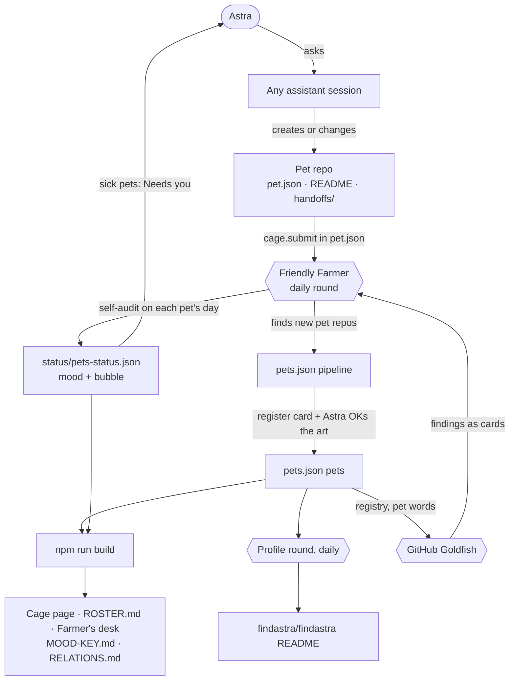
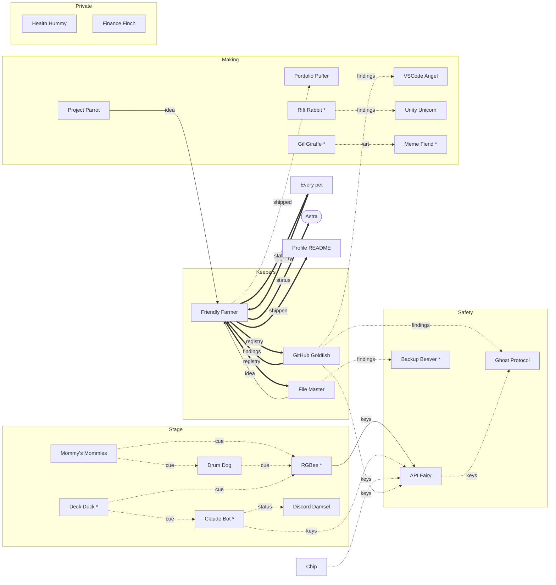

# How the pets relate

*Generated from `relations`, `rounds` and `pipeline` in [pets.json](pets.json) by `npm run build`. Edit pets.json, not this file. The rules behind it are in [PET-FILES.md](PET-FILES.md).*

## How a change is saved

Changes start at the bottom and are saved upward. Nothing generated is edited by hand.

| Level | Who | Owns | Saves by |
|---|---|---|---|
| 1 | **Astra** | Approvals: new art (it costs money), a pet's job, anything in a card waiting on her | Answering a card, or telling an assistant |
| 2 | **Friendly Farmer** (`astras-pet-apps`) | `pets.json`: who exists, kinds, art, relations, the mood key | His daily round, and assistants working on the Cage |
| 3 | **Each pet's repo** | Its own app, README, cards, and its own name, job, status, bubble lines, mood lines and audit | Editing its `pet.json`, and submitting identity changes in `cage.submit` |
| 4 | **Generated** | `cage-data.js`, `ROSTER.md`, the README table, the Farmer's desk, `MOOD-KEY.md`, this file, `status/pets-status.json`, the profile's pet list | Never by hand: the build and the rounds rewrite them |

## Who tells whom

Thick arrows work today. Plain arrows are planned (in a plan or a card). Dotted arrows are ideas nobody has agreed to yet. A name with * is in the pipeline: on GitHub, not registered in the Cage yet.

### What travels

| Kind | Means |
|---|---|
| `registry` | who exists, and each pet's name, job, status, moods and lines |
| `status` | a pet's mood and its one-line bubble |
| `findings` | problems found by an audit |
| `card` | a task left in a handoffs/ folder |
| `keys` | which API keys a pet uses (never the key itself) |
| `idea` | a project idea |
| `shipped` | what changed: new repos, new pets, status changes |
| `cue` | a live trigger: a scene, a beat, a button |
| `art` | drawings and mood frames |

### Every link

| From | To | Carries | State | Why |
|---|---|---|---|---|
| Every pet | Friendly Farmer | `registry` | now | Every pet submits changes to its name, job, status, moods and lines through its own pet.json; the Farmer's daily round takes them. |
| Friendly Farmer | Every pet | `status` | now | The daily round runs each pet's self-audit on its day and writes its mood and bubble. |
| Friendly Farmer | Astra | `status` | now | Every sick pet's need is listed on the Farmer's desk under Needs you. |
| Friendly Farmer | Profile README | `shipped` | now | The profile round keeps findastra/findastra matched to the repos on GitHub. |
| Friendly Farmer | GitHub Goldfish | `registry` | now | The Goldfish reads pets.json, the pet words and the profile style. |
| GitHub Goldfish | Friendly Farmer | `findings` | now | Account-wide problems go to the Farmer as cards. |
| Friendly Farmer | File Master | `registry` | now | File Master uses the pet words and file names. |
| File Master | Friendly Farmer | `idea` | planned | New project folders on the PC become candidates. |
| Project Parrot | Friendly Farmer | `idea` | planned | An idea Astra says yes to becomes a new pet repo. |
| GitHub Goldfish | VSCode Angel | `findings` | idea | Code findings become worklist items. |
| GitHub Goldfish | Ghost Protocol | `findings` | idea | A secret found in a repo becomes a checklist step. |
| API Fairy | Ghost Protocol | `keys` | idea | An old or exposed key becomes a checklist step. |
| RGBee * | API Fairy | `keys` | planned | Cloud light APIs (Govee and others) need keys; API Fairy keeps the notes. |
| Claude Bot * | API Fairy | `keys` | idea | Quick chat uses an Anthropic key. |
| Chip | API Fairy | `keys` | idea | Data Dealer uses several service keys. |
| GitHub Goldfish | API Fairy | `keys` | idea | The Goldfish uses a GitHub token. |
| Friendly Farmer | Portfolio Puffer | `shipped` | idea | What the daily round saw change becomes draft portfolio updates. |
| Claude Bot * | Discord Damsel | `status` | idea | Claude Bot's status feeds the Anthropic presence card. |
| Mommy's Mommies | RGBee * | `cue` | idea | A class or show starts its lighting scene. |
| Mommy's Mommies | Drum Dog | `cue` | idea | A session pulls its track list. |
| Drum Dog | RGBee * | `cue` | idea | Lights follow the track's beat (RGBee v3). |
| Deck Duck * | RGBee * | `cue` | idea | Stream Deck buttons switch scenes. |
| Deck Duck * | Claude Bot * | `cue` | idea | A Stream Deck button opens quick chat. |
| Rift Rabbit * | Unity Unicorn | `findings` | idea | VR performance notes feed world build tasks. |
| Gif Giraffe * | Meme Fiend * | `art` | idea | GIFs Gif Giraffe makes go to the meme collection. |
| File Master | Backup Beaver * | `findings` | idea | What File Master finds unprotected is what Backup Beaver should copy. |

### Private pets

Health Hummy, Finance Finch, Meme Fiend *. These pets' data never leaves the PC. Other pets do not read from them, and the self-audit checks only their repo files.

### On their own so far

Python Panther, Astra Wisp, Paper Girl, Mine Mole *, Mail Snail *, Patch Cat *, Fuzzboi Friend *, Wifi Butterfly *, Mesh Moth *, Raspberry Pi *. Every pet still submits to the Farmer and audits itself; these have no links to other pets yet.
