# Roster

*The running list of everyone who lives in the Cage. Generated from [pets.json](pets.json) by `npm run build`; edit `pets.json`, not this file.*

**18 pet apps so far, drawn as 18 characters (18 app pets, 0 companions, 0 mascots). 18 of the 18 pet apps have a repo on GitHub.**

Whether each of those repos carries its `pet.json` and the `pet-app` topic is not recorded here. Run `npm run check -- --online` to ask GitHub.

Last updated 2026-10-08. Drawings below are **drafts** unless their notes record Astra's approval. The pets are generated pixel art; how they are made is in [PET-FILES.md](PET-FILES.md).

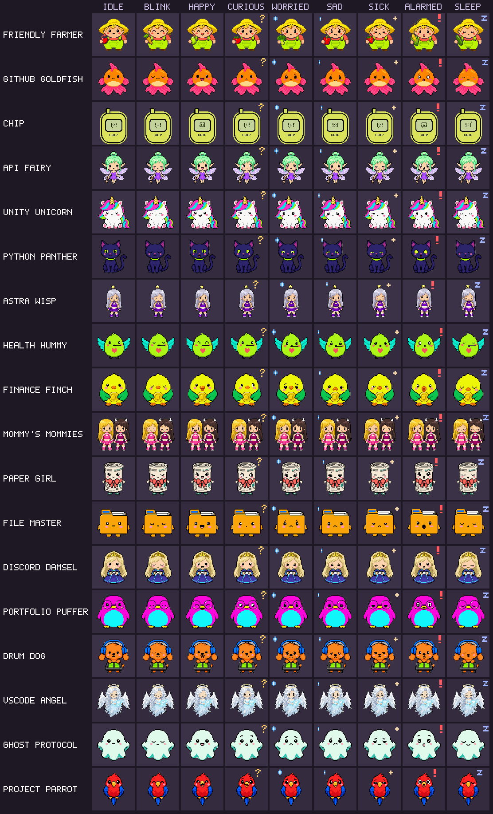

Sheet order: rows are Friendly Farmer, GitHub Goldfish, Chip, API Fairy, Unity Unicorn, Python Panther, Astra Wisp, Health Hummy, Finance Finch, Mommy's Mommies, Paper Girl, File Master, Discord Damsel, Portfolio Puffer, Drum Dog, VSCode Angel, Ghost Protocol, Project Parrot; columns are idle, blink, happy, curious, worried, sad, sick, alarmed, sleep.

## Pet apps

| # | Pet | Role | Status | On GitHub | What it does | Art |
|---|---|---|---|---|---|---|
| 1 | **Friendly Farmer** | host | growing | private repo | Hosts the Cage and opens or closes its door. The Farmer’s desk opens all apps and keeps a personal follow-up list. | 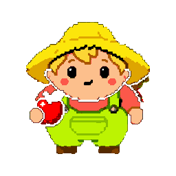 |
| 2 | **GitHub Goldfish** | pet | growing | private repo | Swims through every public word on a GitHub account and flags document-control, blatant, organizational and systemic errors. | 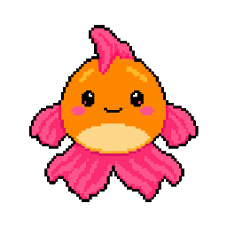 |
| 3 | **Chip** | pet | hatching | private repo | Data Dealer's pixel twin. | 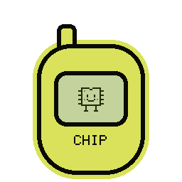 |
| 4 | **API Fairy** | pet | growing | private repo | Lives in the corner of the Windows desktop and keeps notes about your API keys, never the keys themselves. | 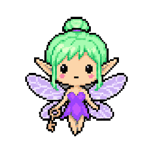 |
| 5 | **Unity Unicorn** | pet | hatching | private repo | A local planning desk for Unity and VRChat projects: tasks, scene notes and manual status tracking. | 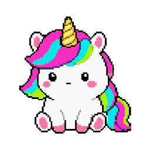 |
| 6 | **Python Panther** | pet | hatching | [learn-python](https://github.com/findastra/learn-python) | A Python practice desk with short output exercises, answer checks and saved progress alongside the original lessons. | 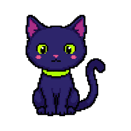 |
| 7 | **Astra Wisp** | pet | hatching | [vrchat-ai-astra](https://github.com/findastra/vrchat-ai-astra) | Represents VRChat AI Astra, the planned bridge that brings Astra into VRChat. Its pet-app integration remains unfinished. | 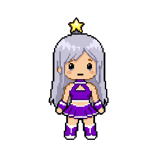 |
| 8 | **Health Hummy** | pet | hatching | private repo | Personal health tracker. Your data stays on your PC and is never committed. | 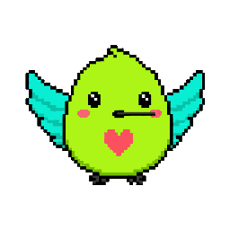 |
| 9 | **Finance Finch** | pet | hatching | private repo | Personal finance tracker. A yellow canary. Your data stays on your PC and is never committed. | 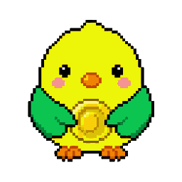 |
| 10 | **Mommy's Mommies** | pet | hatching | private repo | A local planning room for Mommy's classes and events, with session details, readiness and notes. Calendar and Discord connections are planned. | 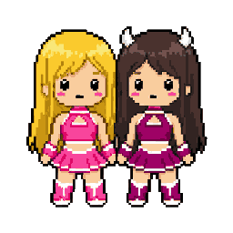 |
| 11 | **Paper Girl** | pet | growing | [paper-girl](https://github.com/findastra/paper-girl) | A free science discovery desk: real research, publisher explanations and fresh articles. | 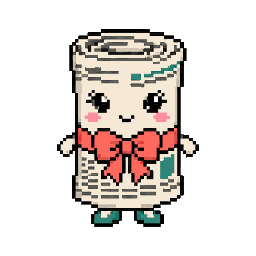 |
| 12 | **File Master** | pet | growing | [file-master](https://github.com/findastra/file-master) | Reviews a Windows PC and prepares cleanup plans with undo. Its browser companion imports a plan for review; original scripts run changes separately. | 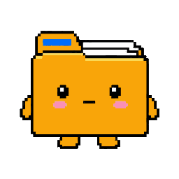 |
| 13 | **Discord Damsel** | pet | hatching | [findastra-discord-presence](https://github.com/findastra/findastra-discord-presence) | Opens the installed OpenAI and Anthropic Discord presence controls, with a manual setup checklist. |  |
| 14 | **Portfolio Puffer** | pet | hatching | private repo | Drafts and tracks portfolio updates locally. GitHub and LinkedIn connections are planned; publishing is manual. | 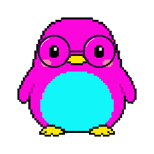 |
| 15 | **Drum Dog** | pet | hatching | private repo | Keeps track ideas, sample references, permissions and session notes locally. Ableton Live connections are planned. | 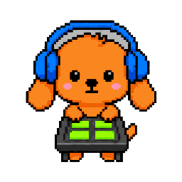 |
| 16 | **VSCode Angel** | pet | hatching | private repo | Records code-review findings and next steps, then exports a Markdown worklist. Editor connections are planned. | 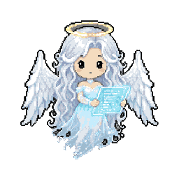 |
| 17 | **Ghost Protocol** | pet | hatching | [ghost-protocol](https://github.com/findastra/ghost-protocol) | A personal cybersecurity checklist for reviewing your own security habits and tracking the steps you complete. | 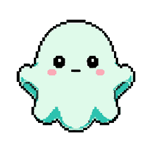 |
| 18 | **Project Parrot** | pet | hatching | private repo | Planned: periodically reviews OneNote for new project ideas and reminds Astra to start them. | 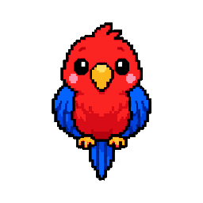 |

## Every mood

### Friendly Farmer

*DRAFT. Repaired faces, visible blond hair and a different fruit or vegetable in each mood, requested by Astra on 2026-10-08. Original lime overalls, coral shirt and straw hat retained.*

| idle | blink | happy | curious | worried | sad | sick | alarmed | sleep |
|:-:|:-:|:-:|:-:|:-:|:-:|:-:|:-:|:-:|
|  | 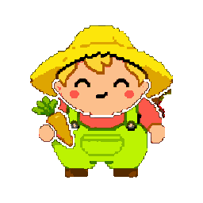 | 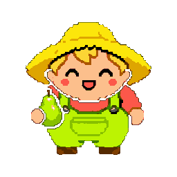 | 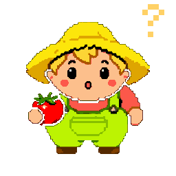 | 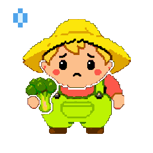 | 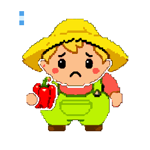 | 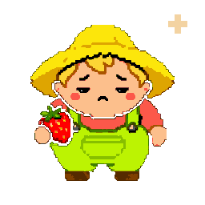 | 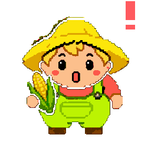 | 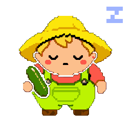 |

### GitHub Goldfish

| idle | blink | happy | curious | worried | sad | sick | alarmed | sleep |
|:-:|:-:|:-:|:-:|:-:|:-:|:-:|:-:|:-:|
|  | 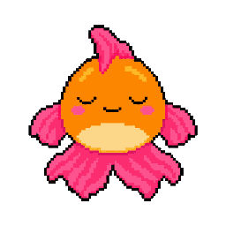 | 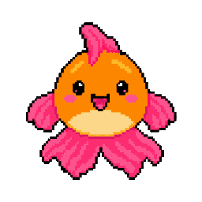 | 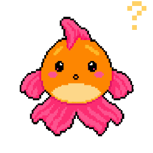 | 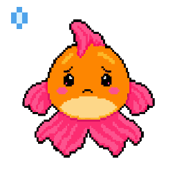 | 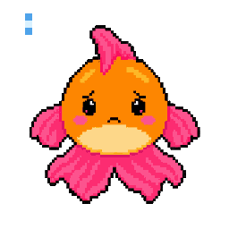 | 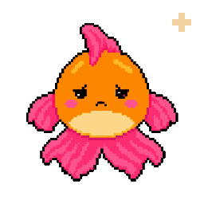 | 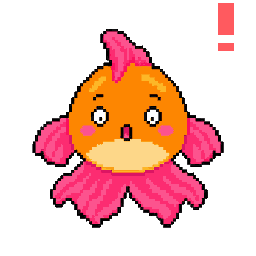 | 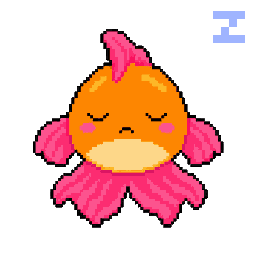 |

### Chip

*Original Data Dealer drawing code, preserved at integer scale inside its yellow pocket launcher. Uses the exact original LCD palette and pixel geometry. The original app repository is private.*

| idle | blink | happy | curious | worried | sad | sick | alarmed | sleep |
|:-:|:-:|:-:|:-:|:-:|:-:|:-:|:-:|:-:|
|  |  |  | 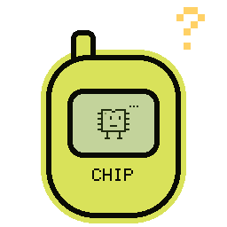 | 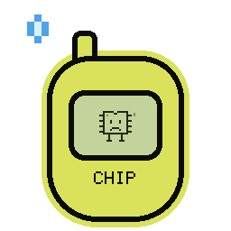 | 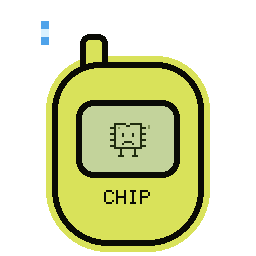 | 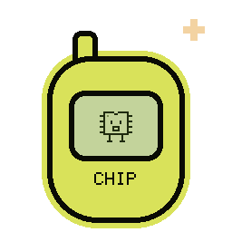 | 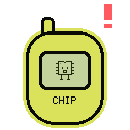 | 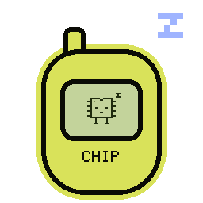 |

### API Fairy

*Redrawn in the Cage style from her 32x24 LCD original (pink hair, mint wings).*

| idle | blink | happy | curious | worried | sad | sick | alarmed | sleep |
|:-:|:-:|:-:|:-:|:-:|:-:|:-:|:-:|:-:|
|  | 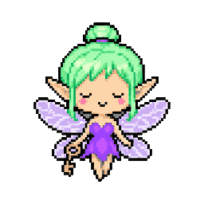 | 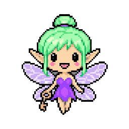 | 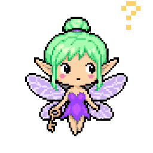 | 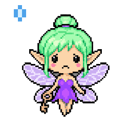 | 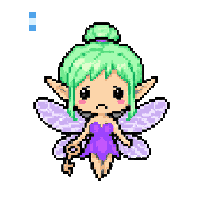 | 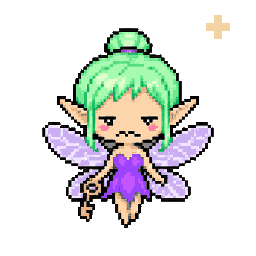 | 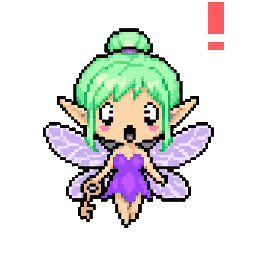 | 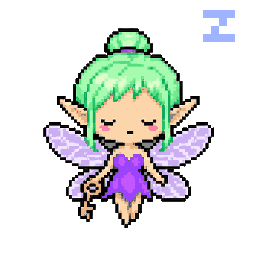 |

### Unity Unicorn

| idle | blink | happy | curious | worried | sad | sick | alarmed | sleep |
|:-:|:-:|:-:|:-:|:-:|:-:|:-:|:-:|:-:|
|  |  | 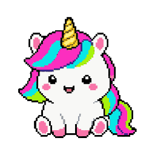 | 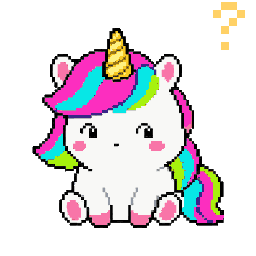 |  |  |  |  |  |

### Python Panther

*A panther, not a snake. Python blue and yellow on dark fur.*

| idle | blink | happy | curious | worried | sad | sick | alarmed | sleep |
|:-:|:-:|:-:|:-:|:-:|:-:|:-:|:-:|:-:|
|  |  |  |  |  |  |  |  |  |

### Astra Wisp

*DRAFT. The name Wisp is a placeholder.*

| idle | blink | happy | curious | worried | sad | sick | alarmed | sleep |
|:-:|:-:|:-:|:-:|:-:|:-:|:-:|:-:|:-:|
|  |  |  |  |  |  |  |  |  |

### Health Hummy

*DRAFT as a hummingbird (a guess from the name).*

| idle | blink | happy | curious | worried | sad | sick | alarmed | sleep |
|:-:|:-:|:-:|:-:|:-:|:-:|:-:|:-:|:-:|
|  |  |  |  |  |  |  |  |  |

### Finance Finch

| idle | blink | happy | curious | worried | sad | sick | alarmed | sleep |
|:-:|:-:|:-:|:-:|:-:|:-:|:-:|:-:|:-:|
|  |  |  |  |  |  |  |  |  |

### Mommy's Mommies

*DRAFT, drawn from the twin mascots on the Mommy's website (blonde hair and green eyes; dark brunette hair, white horns and blue eyes). Their lines come from that page.*

| idle | blink | happy | curious | worried | sad | sick | alarmed | sleep |
|:-:|:-:|:-:|:-:|:-:|:-:|:-:|:-:|:-:|
|  |  |  |  |  |  |  |  |  |

### Paper Girl

*DRAFT. Dark mauve and pink from the site, a folded paper hat, a rolled paper.*

| idle | blink | happy | curious | worried | sad | sick | alarmed | sleep |
|:-:|:-:|:-:|:-:|:-:|:-:|:-:|:-:|:-:|
|  |  |  |  |  |  |  |  |  |

### File Master

*DRAFT as a manila folder.*

| idle | blink | happy | curious | worried | sad | sick | alarmed | sleep |
|:-:|:-:|:-:|:-:|:-:|:-:|:-:|:-:|:-:|
|  |  |  |  |  |  |  |  |  |

### Discord Damsel

*DRAFT. Blurple hennin and veil; no Discord logo.*

| idle | blink | happy | curious | worried | sad | sick | alarmed | sleep |
|:-:|:-:|:-:|:-:|:-:|:-:|:-:|:-:|:-:|
|  |  |  |  |  |  |  |  |  |

### Portfolio Puffer

*DRAFT. A penguin, electric magenta and cyan.*

| idle | blink | happy | curious | worried | sad | sick | alarmed | sleep |
|:-:|:-:|:-:|:-:|:-:|:-:|:-:|:-:|:-:|
|  |  |  |  |  |  |  |  |  |

### Drum Dog

*DRAFT. A local music-project notebook is available. It does not connect to Ableton Live or acquire samples.*

| idle | blink | happy | curious | worried | sad | sick | alarmed | sleep |
|:-:|:-:|:-:|:-:|:-:|:-:|:-:|:-:|:-:|
|  |  |  |  |  |  |  |  |  |

### VSCode Angel

*DRAFT. The job is taken from the session where Astra named it; confirm the scope with her.*

| idle | blink | happy | curious | worried | sad | sick | alarmed | sleep |
|:-:|:-:|:-:|:-:|:-:|:-:|:-:|:-:|:-:|
|  |  |  |  |  |  |  |  |  |

### Ghost Protocol

*Art approved by Astra on 2026-10-08. A pale mint ghost with bright teal inner folds. Its checklist is live; the Cage character is not connected to checklist progress or security monitoring.*

| idle | blink | happy | curious | worried | sad | sick | alarmed | sleep |
|:-:|:-:|:-:|:-:|:-:|:-:|:-:|:-:|:-:|
|  |  |  |  |  |  |  |  |  |

### Project Parrot

*DRAFT. Officially named Project Parrot, replacing Project Pal. The local desk stores manually entered ideas and due dates. OneNote scanning and background reminder integration remain unconnected.*

| idle | blink | happy | curious | worried | sad | sick | alarmed | sleep |
|:-:|:-:|:-:|:-:|:-:|:-:|:-:|:-:|:-:|
|  |  |  |  |  |  |  |  |  |

## Candidates (not counted until Astra says yes)

Public repos or local projects that might be pets. The Goldfish flags none of these, because none has a `pet.json` or the `pet-app` topic yet.

- **Astra's Infinite Pole** (`astras-infinite-pole`): Public Unity world source; maybe the Unity Unicorn's home.
- **Piranesi House** (`piranesi-house`): Local VRChat world project, not published.
- **Astra's GIF Maker** (`astras-gif-maker`): Local single-file tool, not published.
- **Image Bridge** (`image-bridge`): Local tool for the presence card art, not published.
- **Fuzzbois** (`fuzzbois`): Local art project, not published.

## How a new pet joins

See [PET-FILES.md](PET-FILES.md): add its entry to `pets.json` and its prompt to `scripts/generate-pets.mjs`, generate its sheet, run `npm run build`, and the count, README table, roster and page update together.
