# Roster

*The running list of everyone who lives in the Cage. Generated from [pets.json](pets.json) by `node scripts/build-art.mjs`; edit `pets.json`, not this file.*

**14 pet apps so far, drawn as 16 characters (14 app pets, 1 companion, 1 mascot). 6 of the 14 pet apps have a repo on GitHub; none of them is a finished pet app with `pet.json` and the `pet-app` topic yet.**

Last updated 2026-10-07. Every drawing below is a **draft** for Astra to approve or correct.

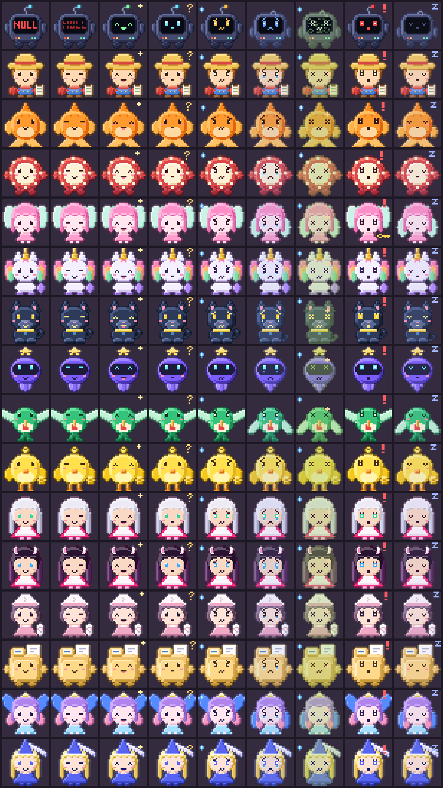

Sheet order: rows are Nullbot, Friendly Farmer, GitHub Goldfish, Chip, API Fairy, Unity Unicorn, Python Panther, Astra Wisp, Healthy Hummy, Finance Finch, Astra (Mommy's twin), Devilish (Mommy's twin), Paper Girl, File Master, Role Fairy, Discord Damsel; columns are idle, blink, happy, curious, worried, sad, sick, alarmed, sleep.

## Pet apps

| # | Pet | Role | Status | On GitHub | What it does | Art |
|---|---|---|---|---|---|---|
| 1 | **Friendly Farmer** | host | hatching | not yet | Hosts the Cage and represents this app. Stands outside it and opens or closes the door when you click him. Manager and auditor of the other pets. | 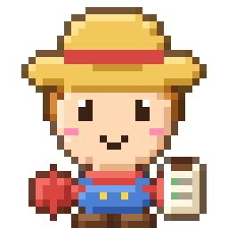 |
| 2 | **GitHub Goldfish** | pet | hatching | not yet | Swims through every public word on a GitHub account and flags document-control, blatant, organizational and systemic errors. |  |
| 3 | **Chip** | pet | hatching | not yet | Data Dealer's pixel twin. | 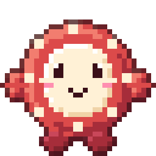 |
| 4 | **API Fairy** | pet | growing | not yet | Lives in the corner of the Windows desktop and keeps notes about your API keys, never the keys themselves. |  |
| 5 | **Unity Unicorn** | pet | hatching | not yet | To be decided with Astra (Unity and VRChat world projects). | 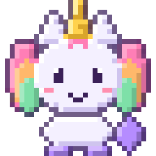 |
| 6 | **Python Panther** | pet | hatching | [learn-python](https://github.com/findastra/learn-python) | The pet attached to Learn Python. Job to be decided with Astra. The repo exists; it still needs pet.json and the pet-app topic. | 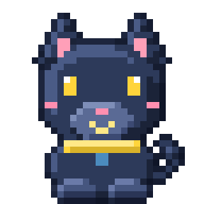 |
| 7 | **Astra Wisp** | pet | hatching | [vrchat-ai-astra](https://github.com/findastra/vrchat-ai-astra) | The pet for VRChat AI Astra: the companion and her bridge into VRChat. The repo exists; it still needs pet.json and the pet-app topic. |  |
| 8 | **Healthy Hummy** | pet | hatching | not yet | Personal health tracker. Your data stays on your PC and is never committed. |  |
| 9 | **Finance Finch** | pet | hatching | not yet | Personal finance tracker. A yellow canary. Your data stays on your PC and is never committed. | 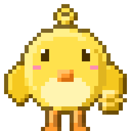 |
| 10 | **Mommy's** | pet | hatching | not yet | Manages Mommy's, the VRChat dance academy and entertainers club, for the Mommies. The pets are the twins from the Mommy's website, Astra and Devilish. | 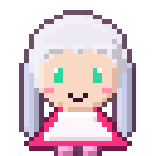 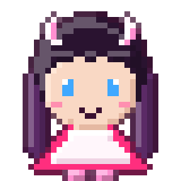 |
| 11 | **Paper Girl** | pet | growing | [paper-girl](https://github.com/findastra/paper-girl) | A free science discovery desk: real research, publisher explanations, fresh articles. The repo exists; it still needs pet.json and the pet-app topic. |  |
| 12 | **File Master** | pet | growing | [file-master](https://github.com/findastra/file-master) | Keeps a Windows PC organized: read-only audits and approval-based cleanup plans with undo. Never deletes. The repo exists; it still needs pet.json and the pet-app topic. | 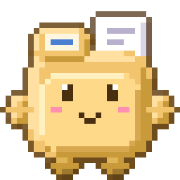 |
| 13 | **Role Fairy** | pet | growing | [role-fairy](https://github.com/findastra/role-fairy) | Mommy's Role Fairy: a single-choice Discord role picker. The repo exists; it still needs pet.json and the pet-app topic. | 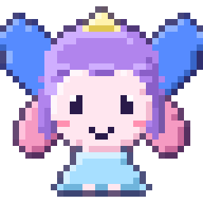 |
| 14 | **Discord Damsel** | pet | hatching | [findastra-discord-presence](https://github.com/findastra/findastra-discord-presence) | Manages the Discord presence apps (OpenAI and Anthropic) and other Discord apps. The repo exists; it still needs pet.json and the pet-app topic. | 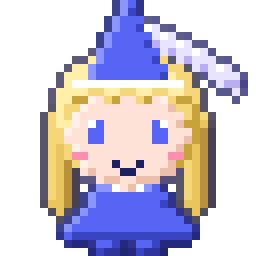 |

## Mascots

| Name | Where it lives | What it does | Art |
|---|---|---|---|
| **Nullbot** | On the roof of the Cage (every page and overlay that draws the Cage) | Stands on the Cage and keeps watch. Not an app of its own. | 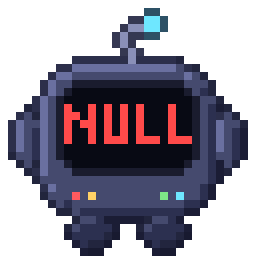 |

## Every mood

### Nullbot

*DRAFT in the Codex companion style. Drawn fresh; it is not OpenAI's Null Signal artwork.*

| idle | blink | happy | curious | worried | sad | sick | alarmed | sleep |
|:-:|:-:|:-:|:-:|:-:|:-:|:-:|:-:|:-:|
|  | 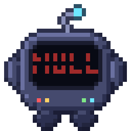 | 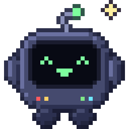 | 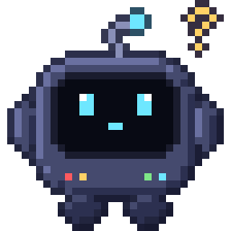 | 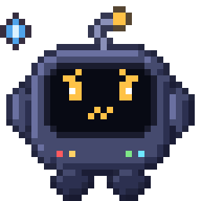 | 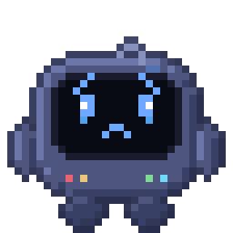 | 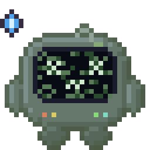 | 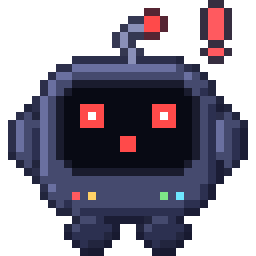 | 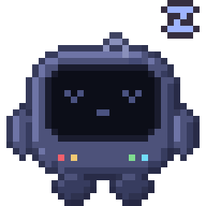 |

### Friendly Farmer

*DRAFT. Holds a clipboard because he audits.*

| idle | blink | happy | curious | worried | sad | sick | alarmed | sleep |
|:-:|:-:|:-:|:-:|:-:|:-:|:-:|:-:|:-:|
|  | 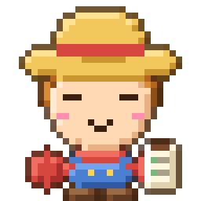 | 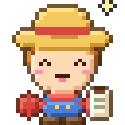 | 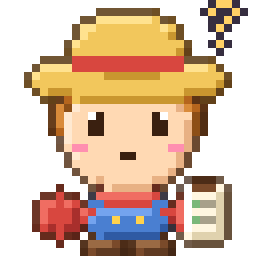 | 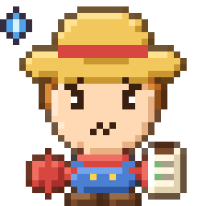 | 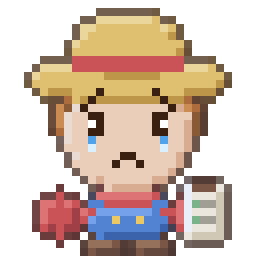 | 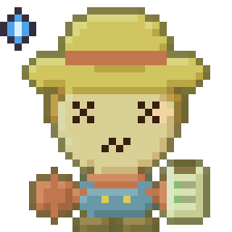 | 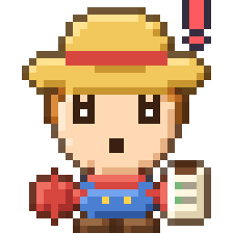 | 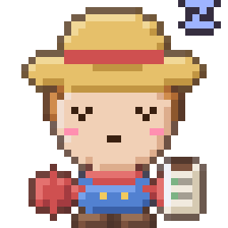 |

### GitHub Goldfish

| idle | blink | happy | curious | worried | sad | sick | alarmed | sleep |
|:-:|:-:|:-:|:-:|:-:|:-:|:-:|:-:|:-:|
|  | 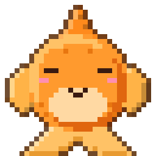 | 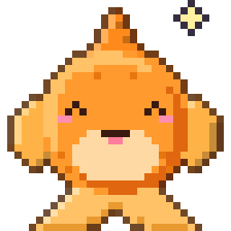 | 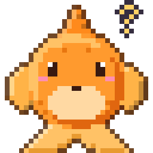 | 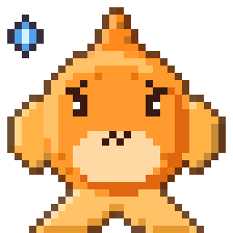 | 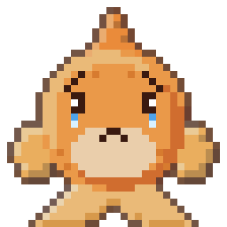 | 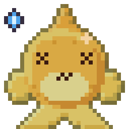 | 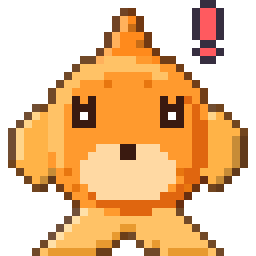 | 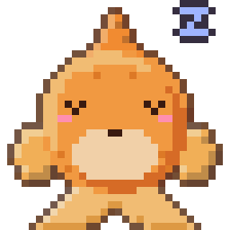 |

### Chip

*DRAFT guessed as a poker chip from the name; the original Chip art is not on this PC. Astra to correct.*

| idle | blink | happy | curious | worried | sad | sick | alarmed | sleep |
|:-:|:-:|:-:|:-:|:-:|:-:|:-:|:-:|:-:|
|  | 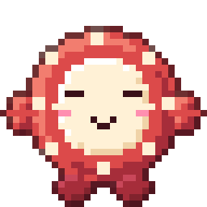 | 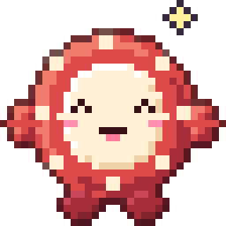 | 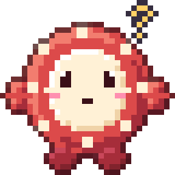 | 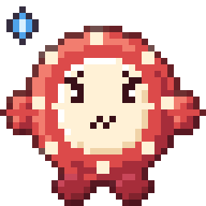 | 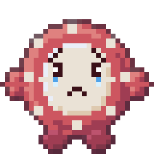 | 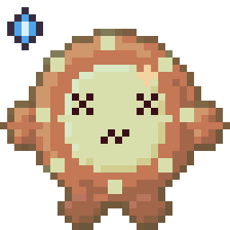 | 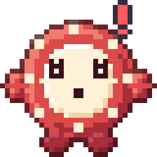 | 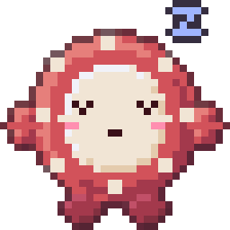 |

### API Fairy

*Redrawn in the Cage style from her 32x24 LCD original (pink hair, mint wings).*

| idle | blink | happy | curious | worried | sad | sick | alarmed | sleep |
|:-:|:-:|:-:|:-:|:-:|:-:|:-:|:-:|:-:|
|  | 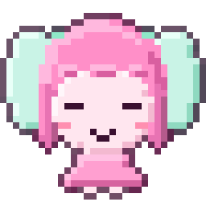 | 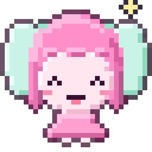 | 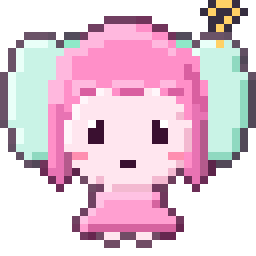 | 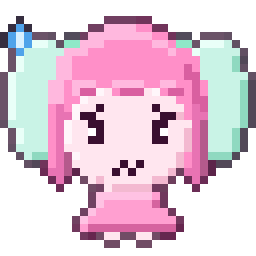 | 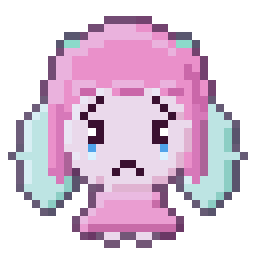 | 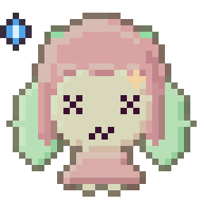 |  |  |

### Unity Unicorn

| idle | blink | happy | curious | worried | sad | sick | alarmed | sleep |
|:-:|:-:|:-:|:-:|:-:|:-:|:-:|:-:|:-:|
|  |  |  |  |  |  |  |  |  |

### Python Panther

*A panther, not a snake. Python blue and yellow on dark fur.*

| idle | blink | happy | curious | worried | sad | sick | alarmed | sleep |
|:-:|:-:|:-:|:-:|:-:|:-:|:-:|:-:|:-:|
|  |  |  |  |  |  |  |  |  |

### Astra Wisp

*DRAFT. The name Wisp is a placeholder.*

| idle | blink | happy | curious | worried | sad | sick | alarmed | sleep |
|:-:|:-:|:-:|:-:|:-:|:-:|:-:|:-:|:-:|
|  |  |  |  |  |  |  |  |  |

### Healthy Hummy

*DRAFT as a hummingbird (a guess from the name).*

| idle | blink | happy | curious | worried | sad | sick | alarmed | sleep |
|:-:|:-:|:-:|:-:|:-:|:-:|:-:|:-:|:-:|
|  |  |  |  |  |  |  |  |  |

### Finance Finch

| idle | blink | happy | curious | worried | sad | sick | alarmed | sleep |
|:-:|:-:|:-:|:-:|:-:|:-:|:-:|:-:|:-:|
|  |  |  |  |  |  |  |  |  |

### Astra (Mommy's twin)

*DRAFT, drawn from the twin mascots on the Mommy's website (silver hair and green eyes; dark hair, white horns and blue eyes). Their lines come from that page.*

| idle | blink | happy | curious | worried | sad | sick | alarmed | sleep |
|:-:|:-:|:-:|:-:|:-:|:-:|:-:|:-:|:-:|
|  |  |  |  |  |  |  |  |  |

### Devilish (Mommy's twin)

*Companion in Mommy's.*

| idle | blink | happy | curious | worried | sad | sick | alarmed | sleep |
|:-:|:-:|:-:|:-:|:-:|:-:|:-:|:-:|:-:|
|  |  |  |  |  |  |  |  |  |

### Paper Girl

*DRAFT. Dark mauve and pink from the site, a folded paper hat, a rolled paper.*

| idle | blink | happy | curious | worried | sad | sick | alarmed | sleep |
|:-:|:-:|:-:|:-:|:-:|:-:|:-:|:-:|:-:|
|  |  |  |  |  |  |  |  |  |

### File Master

*DRAFT as a manila folder.*

| idle | blink | happy | curious | worried | sad | sick | alarmed | sleep |
|:-:|:-:|:-:|:-:|:-:|:-:|:-:|:-:|:-:|
|  |  |  |  |  |  |  |  |  |

### Role Fairy

*DRAFT. Butterfly wings in the role colours (blue, pink).*

| idle | blink | happy | curious | worried | sad | sick | alarmed | sleep |
|:-:|:-:|:-:|:-:|:-:|:-:|:-:|:-:|:-:|
|  |  |  |  |  |  |  |  |  |

### Discord Damsel

*DRAFT. Blurple hennin and veil; no Discord logo.*

| idle | blink | happy | curious | worried | sad | sick | alarmed | sleep |
|:-:|:-:|:-:|:-:|:-:|:-:|:-:|:-:|:-:|
|  |  |  |  |  |  |  |  |  |

## Candidates (not counted until Astra says yes)

Public repos or local projects that might be pets. The Goldfish flags none of these, because none has a `pet.json` or the `pet-app` topic yet.

- **Ghost Protocol** (`ghost-protocol`): Public repo, a personal cybersecurity checklist; a ghost would suit it.
- **Astra's Infinite Pole** (`astras-infinite-pole`): Public Unity world source; maybe the Unity Unicorn's home.
- **Piranesi House** (`piranesi-house`): Local VRChat world project, not published.
- **Astra's GIF Maker** (`astras-gif-maker`): Local single-file tool, not published.
- **Image Bridge** (`image-bridge`): Local tool for the presence card art, not published.
- **Fuzzbois** (`fuzzbois`): Local art project, not published.

## How a new pet joins

See [PET-FILES.md](PET-FILES.md): add its entry to `pets.json`, draw it in `scripts/pets-art.mjs`, run `npm run build`, and the count, README table, roster and page update together.
